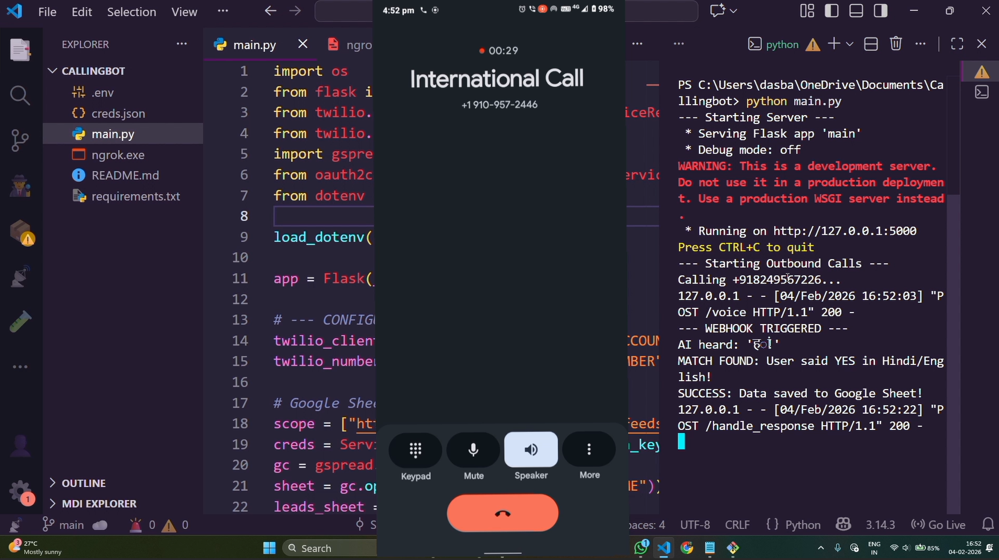
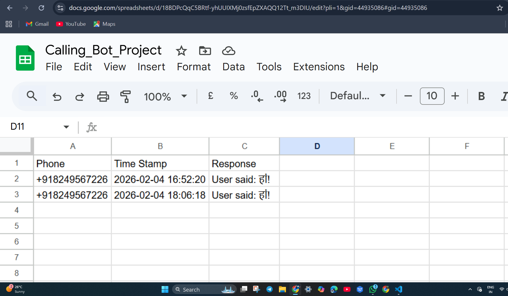

---
# 🧾 Hindi AI Calling Bot – Automated Lead Qualification with Google Sheets Integration

_An open-source outbound calling system using Python, Twilio, and Flask to automate service introductions in Hindi and log customer interest in real-time._

---


## 📌 Table of Contents
- <a href="#overview">Overview</a>
- <a href="#project-problem">Project Problem</a>
- <a href="#workflow-logic">Workflow Logic</a>
- <a href="#tools--technologies">Tools & Technologies</a>
- <a href="#project-structure">Project Structure</a>
- <a href="#setup--installation">Setup & Installation</a>
- <a href="#how-to-run-this-project">How to Run This Project</a>
- <a href="#author--contact">Author & Contact</a>

---
<h2><a class="anchor" id="overview"></a>Overview</h2>

This project is an automated telephony solution designed to handle outbound lead qualification. Built with Python and integrated with the Twilio API, the bot retrieves mobile numbers from a Google Sheet, initiates a voice call with a natural Hindi AI voice, processes user speech intent (Yes/No), and updates a secondary "Interested" sheet based on the conversation outcome.

### 1. Video Demo
Below is a screen recording of the bot in action, featuring the Hindi AI voice interaction and real-time logic processing.

https://github.com/SBanditaDas/Hinglish-AI-Calling-Bot/blob/main/demo.mp4?raw=true

### 2. Real-Time Result (Google Sheets Sync)
This image confirms that the bot successfully recognized the "Haan" (Yes) intent and updated the **Interested** worksheet automatically.




---

## 🛠️ Cost Optimization Research
To ensure this project is scalable for high-volume business use, I conducted an industry-level cost-benefit analysis. By transitioning from a standard Cloud API to wholesale SIP providers, the operational cost can be reduced by **over 70%**.

📂 **Explore the full research here:** [Telephony Market Research & Cost Analysis](https://github.com/SBanditaDas/Telephony-Market-Research-Cost-Analysis)

---
<h2><a class="anchor" id="project-problem"></a>Project Problem</h2>

Manual calling for lead qualification is time-consuming and expensive. This project solves this by:

⋙ Automating Outreach: Reducing manual effort by calling a list of leads automatically.
⋙ Natural Language Interaction: Using Hindi (hi-IN) speech recognition to communicate in the local language.
⋙ Real-time Data Sync: Eliminating manual data entry by logging "Interested" leads directly to Google Sheets.

---
<h2><a class="anchor" id="workflow-logic"></a>Workflow Logic</h2>

The system follows a multi-step orchestration process:

1. Lead Retrieval: Reads the Leads worksheet using the Google Sheets API.
2. Outbound Call: Triggers a call via Twilio and plays a Hindi introduction: "Namaste! Kya aap hamara service lena chahete ho?"
3. Intent Gathering: Uses Twilio <Gather> to capture the user's speech in Hindi script.
4. Speech Analysis: Parses the SpeechResult. If it detects positive keywords (e.g., "हां", "Yes", "Haan"), it moves to the success logic.
5. Database Update: Appends the user's phone number and timestamp to the Interested worksheet.

---

<h2><a class="anchor" id="tools--technologies"></a>Tools & Technologies</h2>

```
i.  Python: Core logic and automation.
ii. Flask: Backend web server to handle Twilio Webhooks.
iii.Twilio API: PSTN connectivity, Call control, and Speech-to-Text.
iv. Amazon Polly (Aditi): Natural Hindi Text-to-Speech engine.
v.  Gspread & OAuth2: Google Sheets API integration.
vi. Ngrok: Secure tunneling for local development.
```
---

<h2><a class="anchor" id="project-structure"></a>Project Structure</h2>

```
hindi_calling_bot/
│
├── main.py                 # Core Flask application and calling logic
├── .env                    # Environment variables (API Keys, Phone Numbers)
├── creds.json              # Google Service Account credentials
├── requirements.txt        # Python dependencies
└── README.md               # Project documentation
```
---

<h2><a class="anchor" id="setup--installation"></a>Setup & Installation</h2>

1. Clone the repository:  
```bash
git clone https://github.com/SBanditaDas/Hindi-AI-Calling-Bot.git
```
2. Install Dependencies:
```
pip install flask gspread oauth2client twilio python-dotenv
```
3. Configure Environment Variables:
Create a .env file and add your credentials:
```
TWILIO_ACCOUNT_SID=your_sid
TWILIO_AUTH_TOKEN=your_token
TWILIO_PHONE_NUMBER=your_twilio_number
GOOGLE_SHEET_NAME=Calling_Bot_Project
```
4. Share Google Sheet:

  ⋙ Share your Google Sheet with the client_email found in your creds.json as an Editor.
   
---

<h2><a class="anchor" id="how-to-run-this-project"></a>How to Run This Project</h2>

1. In Bash/terminal run:
     ```python main.py```
   
2. Start the Ngrok Tunnel:
   
(In a separate terminal):
    ```./ngrok http 5000```


⁘ Configure Twilio Webhook:

→ Copy the Ngrok URL and paste it into the "A Call Comes In" section of your Twilio Number console followed by /voice.

⁘ Trigger Calls:

→ The script will automatically pick up numbers from the Leads tab and begin dialing.

---

<h2><a class="anchor" id="author--contact"></a>Author & Contact</h2>

**Sushree Bandita Das**  
 
 📧 Email: sushreebanditadas01@gmail.com  
 
<h3 align="left"></h3> 
<p align="left">
  <a href="https://twitter.com/S_Bandita_Das" target="blank">
    
  </a>
  <a href="http://www.linkedin.com/in/sushree-bandita-das-160651309" target="blank">
    
  </a>
  <a href="https://github.com/SBanditaDas" target="blank">
    
  </a>
  <a href="https://www.kaggle.com/dasbanditasushree" target="blank">
    
  </a>

</p>

---
